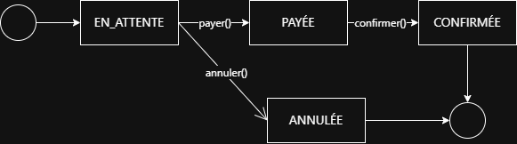

# Design Decisions

---

## Q1 — Flight and company modeling

### Flight identity vs flight number

A `Vol` has two different identifiers:

- `id: UUID` is the technical identity of the object.
- `numero: String` is the business flight number.

Two different `Vol` objects may technically have the same `numero`, but a single `Compagnie` is not allowed to contain two flights with the same number.

Therefore:

- `Vol.equals()` and `Vol.hashCode()` use the technical UUID.
- flight number uniqueness is enforced by `Compagnie`.
- both `Compagnie.addVol(vol)` and `vol.setCompagnie(compagnie)` preserve this invariant.

### Bidirectional association

The association between `Compagnie` and `Vol` is bidirectional:

- adding a flight to a company updates the flight's company reference;
- changing a flight's company updates both the old and the new company collections;
- removing a flight from a company clears the flight's company reference.

---

## Q2 — Airport and city modeling

An `Aeroport` references exactly one `Ville`.

A `Ville` can be served by one or more airports. For example, a large city may have several airports, while each airport is located in one main city.

This gives the following multiplicity:

```text
Ville 1 --- 0..* Aeroport
Aeroport 1 --- 1 Ville
```

In the implementation, the relationship is stored only from `Aeroport` to `Ville` to keep the model simple and avoid unnecessary bidirectional coupling.

---

## Q3 — Stopover modeling

### Escale as an association class

An `Escale` is not an `Aeroport`.

An airport is a stable domain entity, while an escale represents the passage of a specific flight through an airport. This passage has its own information:

- arrival time
- departure time
- derived duration
- possibly an order in the route

A simple association between `Vol` and `Aeroport` would not be enough, because the association itself carries data. For this reason, `Escale` is modeled conceptually as an association class between `Vol` and `Aeroport`.

The chosen model is:

- one `Vol` contains zero or more `Escale`;
- one `Escale` references exactly one `Aeroport`;
- no escale is represented by an empty escale collection, not by a fake airport or a `NullEscale`.

In the implementation, `Escale` is represented as a normal class contained by `Vol`. It extends `Etape` only to reuse the common temporal attributes `depart`, `arrivee`, and the derived duration calculation. Conceptually, however, an escale remains an enriched relation between a flight and an airport.

---

## Q4 — Reservation modeling

### Reservation as a domain entity

A `Reservation` is modeled as a real domain entity, not as a simple association between `Client` and `Vol`.

A reservation has its own identity and business data:

- reservation number
- creation date
- price
- client
- passenger
- flight
- current state

This is necessary because a reservation has its own lifecycle: it can be paid, confirmed, or cancelled depending on its current state.

### Client and passenger distinction

`Client` and `Passager` are modeled as two separate concepts.

A `Client` is the person or entity that creates and pays for reservations.  
A `Passager` is the person who actually travels on a flight.

This distinction is required because one client may reserve flights for different passengers. Therefore, a reservation references exactly one client and exactly one passenger.

### Pricing strategy

Reservation pricing is separated from reservation creation by using the Strategy pattern.

The `PolitiqueTarif` interface defines one operation:

```java
double calculer(double basePrice);
```

Each implementation applies a different pricing rule, such as economy, business, or promotional pricing.

### Reservation creation with Factory

Reservations are created through `ReservationFactory`.

This centralizes reservation creation and keeps the constructor controlled. The factory is responsible for:

- generating a reservation number;
- applying a pricing policy;
- creating a reservation with its client, passenger and flight.

By default, the factory uses the economy pricing policy.

---

## Q5 — Reservation state modeling

### Reservation state model

A reservation has one current state at a time.

We do not represent reservation status with multiple booleans such as `paid`, `confirmed`, or `cancelled`, because this could create inconsistent combinations.

Instead, reservation states are modeled with the State pattern.

The possible states are:

- `EnAttente`: initial state
- `Payee`: payment has been completed
- `Confirmee`: reservation is confirmed
- `Annulee`: reservation is cancelled

Each state is responsible for deciding which transitions are allowed and which transitions are forbidden.

### Reservation state transitions

The reservation lifecycle is modeled with the following transitions:



```text
EN_ATTENTE
   -- payer() --> PAYEE
   -- annuler() --> ANNULEE
   -- confirmer() --> forbidden

PAYEE
   -- confirmer() --> CONFIRMEE
   -- payer() --> forbidden
   -- annuler() --> forbidden in the current simplified model

CONFIRMEE
   -- payer(), confirmer(), annuler() --> forbidden

ANNULEE
   -- payer(), confirmer(), annuler() --> forbidden
```

Forbidden transitions throw a `TransitionInterditeException`.

### Why State Pattern instead of a simple enum

A simple enum would be enough if states only stored names.

However, in this model, each state has its own behavior:

- `EnAttente` allows payment and cancellation.
- `Payee` allows confirmation.
- `Confirmee` forbids further modification.
- `Annulee` forbids further modification.

For this reason, the State pattern is more explicit and avoids large conditional blocks inside `Reservation`.

---

## Q6 — Regular flights and shared routes

The solution can be interpreted as an application of the Flyweight pattern.

`Trajet` represents the intrinsic state shared between several regular flights:

- ordered list of steps;
- airports;
- relative arrival/departure offsets.

`Vol` represents the extrinsic state of a concrete flight occurrence:

- departure date and time;
- arrival date and time;
- reservations;
- flight-specific information.

This avoids duplicating the same route structure for every regular flight.

To avoid side effects caused by sharing, `Trajet` must be immutable. Its list of steps is sorted at construction time and exposed as a non-modifiable structure. Therefore, several flights can share the same `Trajet` without dangerous aliasing.

---

## Q7 — Package organization

```text
src/main/java/org/uca
├── aeroport        # Flight domain: airports, cities, companies, flights, stops and routes
└── reservation     # Reservation domain: bookings, passengers, payments, pricing and states
    ├── model       # Core reservation entities
    ├── pricing     # Pricing strategies
    └── state       # Reservation state pattern
```

This package organization separates the flight domain from the reservation domain.

The `aeroport` package contains the classes related to flights, airports, companies, stops and routes.

The `reservation` package contains the reservation logic. It is divided into:

- `model` for the main reservation entities;
- `pricing` for fare calculation strategies;
- `state` for reservation states and transitions.

The `aeroport` package is independent from `reservation`, because flights, airports and companies can exist without reservations.

The `reservation` package depends only on `aeroport` to associate a reservation with one flight.

This structure keeps responsibilities clear and reduces coupling between unrelated parts of the application.
